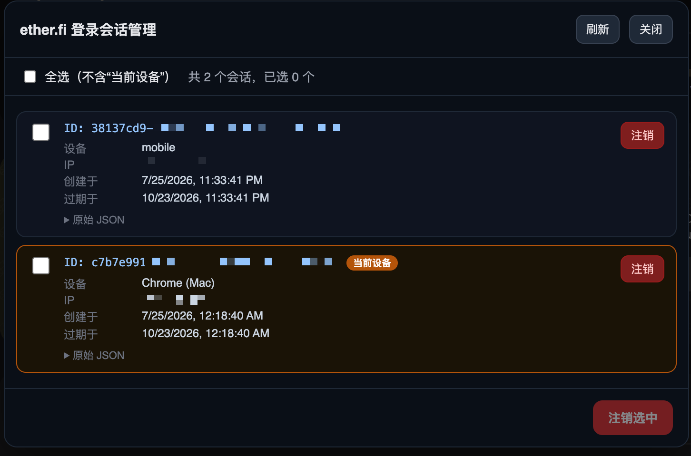

  
  <h1>ether.fi 会话管理脚本</h1>
  
一个 Tampermonkey 用户脚本，用来<b>查看并注销 ether.fi Cash 的登录会话</b>（登出其它设备）。

---

## 界面预览

  

## 为什么需要它

ether.fi Cash 用服务端 cookie 会话保持登录。**改密码或加 2FA 并不会让其它设备上已存在的会话失效**，而且网页界面里没有“登出所有设备”的按钮。如果你在某台设备上登录后忘了退出，官方没有任何内置办法能踢掉那个会话。

本脚本把 ether.fi **自带、却没在界面暴露**的内部会话管理接口调出来，用一个小面板让你选中并注销会话。

| 接口 | 方法 | 作用 |
| --- | --- | --- |
| `/app/cash/api/v2/sessions` | `GET` | 列出你所有活跃会话 |
| `/app/cash/api/v2/sessions/{id}` | `DELETE` | 注销指定的某个会话 |

脚本只会用**你自己浏览器里的登录 cookie** 与 `www.ether.fi` 通信 —— 不采集、不保存、也不向任何第三方发送任何凭据。

> 说明：ether.fi Cash 的会话默认有效期约 **90 天**（见上图“过期于”），在你手动注销或自然过期之前会一直有效。这也是忘记登出的会话能长期存在的原因。

## 安装

1. 安装 [Tampermonkey](https://www.tampermonkey.net/)（或 Violentmonkey 等兼容的脚本管理器）。
2. 点击安装：
   **[➡ 安装 `etherfi-session-manager.user.js`](https://raw.githubusercontent.com/__GH_OWNER__/__GH_REPO__/main/etherfi-session-manager.user.js)**
   Tampermonkey 会打开安装页，确认即可。
3. 脚本头部已配置 `@updateURL` / `@downloadURL`，之后会**自动更新**到新版本。

## 使用

1. 打开 **https://www.ether.fi** 并**登录 Cash**（脚本依赖你已登录的 cookie）。
2. 点击右下角的 **🔒 Sessions** 按钮。
3. 面板会列出全部活跃会话。勾选要踢掉的会话（或点 **全选**），再点 **注销选中**；每一行也有单独的 **注销** 按钮。

### 注意事项

- **全选** 会故意**排除**被识别为“当前设备”的会话（面板中橙色高亮、标有“当前设备”），避免你把自己也登出。若想彻底重置，可手动勾上它（会弹出确认，注销后需要重新登录）。
- 接口返回的字段名并无公开文档，脚本做了**兜底解析**：自动识别会话列表与 `id` 字段，并为每条会话提供 **“原始 JSON”** 展开。若某行找不到 `id`，可展开其原始 JSON 并在 Issue 中反馈其结构，以便精确适配。

## 工作原理

脚本完全复刻了 ether.fi 前端发起已认证请求的方式：相同的基路径（`/app/cash/api`）、`credentials: 'include'`（从而带上 httpOnly 会话 cookie），以及相同的 `X-Active-User` 请求头（取自 `localStorage.active_user`）。实现为单个、零依赖的 `.user.js` 文件，界面用 Shadow DOM 隔离样式，可直接阅读源码。

## 免责声明

本项目与 ether.fi 无任何隶属、背书或支持关系。这是一个独立的小工具，代表你、针对**你自己的**账户会话，调用该网站自身的接口。请自行承担使用风险。内部接口可能随时更改或下线，恕不另行通知。

## 许可证

[MIT](./LICENSE) © __AUTHOR__
